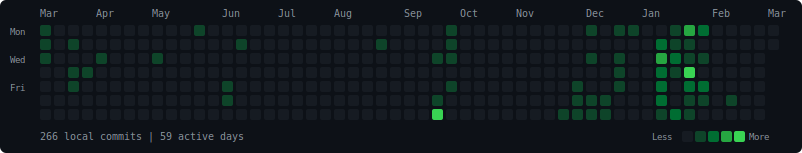

<div align="center">
  <a href="https://1tx.dev"></a>
</div>

<br>

<div align="center">
  <a href="https://1tx.dev">1tx.dev</a>&nbsp;&nbsp;&nbsp;·&nbsp;&nbsp;&nbsp;<a href="https://substack.com/@deltaconfidence">writing</a>&nbsp;&nbsp;&nbsp;·&nbsp;&nbsp;&nbsp;<a href="https://orcid.org/0009-0000-0985-4721">research</a>
</div>

<br>

```
python · rust · typescript · elixir · solidity
```

computer vision · agentic systems · prediction markets · on-chain infrastructure

<br>

<div align="center">
  <a href="https://trufonomics.com"></a>
</div>

<br>

<div align="center">
  
</div>

<br>

<div align="center">
  <picture>
    <source media="(prefers-color-scheme: dark)" srcset="https://raw.githubusercontent.com/kluless13/kluless13/output/github-contribution-grid-snake-dark.svg" />
    <source media="(prefers-color-scheme: light)" srcset="https://raw.githubusercontent.com/kluless13/kluless13/output/github-contribution-grid-snake.svg" />
    
  </picture>
</div>
